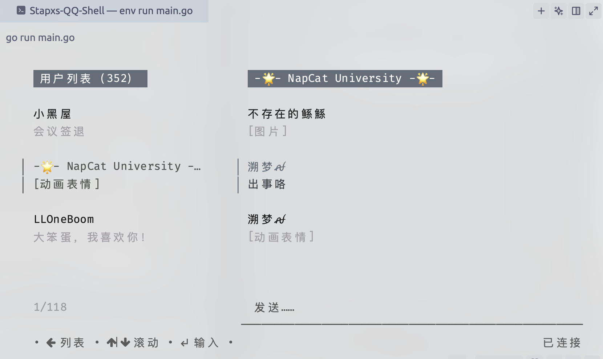

  <h2 align="center" style="font-weight: 600">Stapxs QQ Shell</h2>
 

  
 

  

    一个兼容 Napcat 的简易 TUI Obebot 客户端
     
    <a href="https://github.com/Stapxs/Stapxs-QQ-Shell/releases" target="blank"><strong>📦️ 下载程序</strong></a>&nbsp;&nbsp;|&nbsp;&nbsp;
    <a href="https://github.com/Stapxs/Stapxs-QQ-Shell/issues" target="blank"><strong>💬 反馈问题</strong></a>
     
     
    <strong>本应用仅供学习交流使用，请勿用于其他用途</strong> 
    <strong>版权争议请提出 issue 协商</strong>
  

